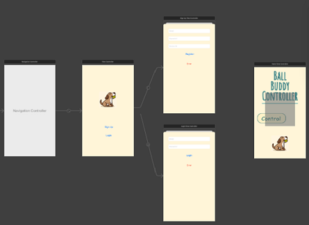

  

<h1 align="center">Ball Buddy :softball: </h1>

<!-- TABLE OF CONTENTS -->

  
Table of Contents

  <ol>
    <li><a href="#about-the-project">About The Project</a></li>
    <li><a href="#key-features">Key Features</a></li>
    <li><a href="#documentation">Documentation</a>
        <ul>
        <li><a href="#cad">CAD</a></li>
        <li><a href="#code">Code</a></li>
      </ul>
    </li>
    <li><a href="#materials">Materials</a></li>
    <li><a href="#progress">Progress</a></li>
    <li><a href="#contact">Contact</a></li>
  </ol>

<!-- ABOUT THE PROJECT -->
## About The Project

Ball Buddy is a pet ball launcher developed in my senior design class. It is inspired by a teammates dog which has separation anxiety, which would become exacerbated after work from home is lifed. In response we created a smart ball launcher so that we could help pets keep in touch with their owners from far away.

My main repsonibilites are in charge of designing and coding the ball recovery system. For the chassis design I will be working together with one of my teammates, Jason. I will also be helping on the webapp devlopment by creating a functional backend and database to control the ball recovery system.

## Key Features 
* Autonomous ball recovery and launch
* Controllable through an app or webpage
* 180 degree rotational and launch angles
* Saftey sensors to avoid injury
* Camera to view pets and launch trajectory 

## Documentation 
The CAD designs and code are a work in progress and will have continual updates. Currently the designs are focused for the ball recovery system but will eventually include the entire Ball Buddy. The code is for both the ball recovery system and ball launcher. Additional Raspberry pi code is also featured for software debugging.

### CAD 
All current CAD designs are in the Ball System V1 and V2. V1 was the first mockup design I created for the ball recovery system. It utilized a chain and gear mechanic to have simple stepper motor utilization. This design however was unable to adjust to any future changes to the ball buddy and was scrapped for the current V2 design. The V2 design is based on a CNC/3D printer using gantry rails, pulleys and stepper motors to control the x,y, and z axis. With this new design it is possible to move the ball in any  position within the frame and have room to adjust for other parts. Most parts were redesigned from V1 but I did keep the ball setter hand and ball que. 

All parts were designed in Solidworks and can be converted to STL for printing.

### Code 
The MasterStepper is the current code used to control all 5 stepper motors in the ball recovery system. This includes motor to spin the ball que, 2 motors to lift up the X-axis, and 2 motors to control the X-axis ball setter hand. The code has funcitons to adjust distance and individual controls for each axis. It also takes serial input to move and  outputs serial data for debugging. This code is ran on a Arduino Uno R3.

Utilizing the Arduino for the brute work, I used the Raspberry Pi for the main processing of data. While our software developer worked on setting up a permanent server, I began to develop groundwork Pi code to work with our Arduino. Since I utilized serial communication for the Arduino, I used a usb connection to the Raspberry Pi for both microcontrollers to talk to each other. With communication between the two microcontrollers established, I used the html library in python to create a basic webpage that could send commands to the Pi. This let me access the Pi from a webpage that would send serial data to the arduino which could then relay data back for the Pi to process. The Pi python code was ran on a Raspberry Pi 4

## Materials 

Part| Price | System
------------ | -------------| -------------
Pixy2 Camera | $60 | Ball Launcher
Camera Module   | $50 | Ball Launcher
Raspberry Pi| $40 | App
Arduino Mega 2560 | $15 | Ball Recovery & Ball Launcher
Nema 17 Stepper Motor (x3)| $17 (x3) | Ball Recovery
Nema 17 with T8 Screw Lead (x2)| $15 (x2) | Ball Recovery
BIQU A4988 Motor Drivers| $10 | Ball Recovery
4 400mm 2020 V type Gantry Rai| $34 | Ball Recovery
2 700mm 2040 V type Gantry Rail | $31 | Ball Recovery
2 350mm 2040 V Type Gantry Rail | $20 | Ball Recovery
6mm Eccentric Spacers | $10 | Ball Recovery
Assorted M2-6 Screws and Nuts | $30 | Ball Recovery
5m by 6mm Timing Belt Kit | $16 | Ball Recovery
BTS7960 Motor Driver | $13 | Ball Launcher
Electromagnetic Solenoid (x2) | $16 (x2) | Ball Launcher
**Total Amount Spent**| $442 | |

## Progress 

  
  
  

The first image is the log in screen and the following pannels that follow to log in and register. After registering or logging in, the user is then proceeded to the controls page which features a camera to show what the ball launcher is looking at. There are buttons at bellow the screen to move the launcher left and right. There is also a slider below to choose the amount of speed and distance the ball will be launched. The final button at the bottom is used to reload the ball and set up for the next launch. 

At the bottom there are also 2 status displays to give the user updates on the ball launcher. The first status confirms that the ball launcher is online and connceted to the application. The second status is to confirm which cylce the ball launcher is at. Currently the ball launcher is in the launch phase and since the sensor detects a dog, it will not launch until the dog moves away from the launcher. 

  

The sensors we used to detect humans and dogs is the nexy2 pixy camera. It has its own software similar to openCV that takes samples and then categorizes them accordingly to the user preference. In this case, we took Jenny the dog as our sample and gave her the identifier "dog". Using multiple samples we are able to have the camera recognize Jenny as a dog and are then futher able to work upon this data to create our saftey sensor.

<!-- CONTACT -->
## Contact 

Dustin Nguyen - dustinnvn@gmail.com

Project Link: [https://github.com/Dustinnvn/Ball-Buddy](https://github.com/Dustinnvn/Ball-Buddy)

